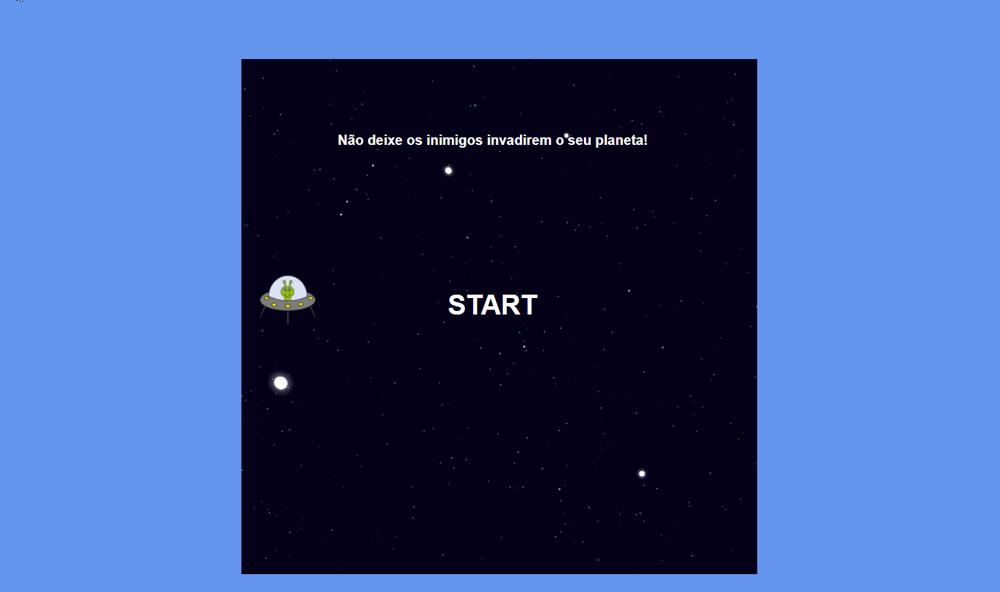

<!--Banner session-->

  

<!--About session-->
<h1 align="center">Recriando o Jogo Space Shooter Digital Innovation One</h1>

Curso do Bootcamp JavaScript Game Developer da [Digital Innovation One](https://digitalinnovation.one/).

Nesse projeto, o desafio será criar um Space Shooter utilizando HTML, CSS e Javascript. Aprenderemos juntos a trabalhar com posicionamento no CSS e lógica de programação utilizando posicionamento com CSS, manipulação do DOM, eventListeners, e manipulação de Array.

<h3>👨‍💻 Tecnologias utilizadas</h3>

- [HTML](https://www.w3schools.com/html/)
- [CSS](https://developer.mozilla.org/pt-BR/docs/Web/CSS)
- [JavaScript](https://developer.mozilla.org/en-US/docs/Web/JavaScript)

